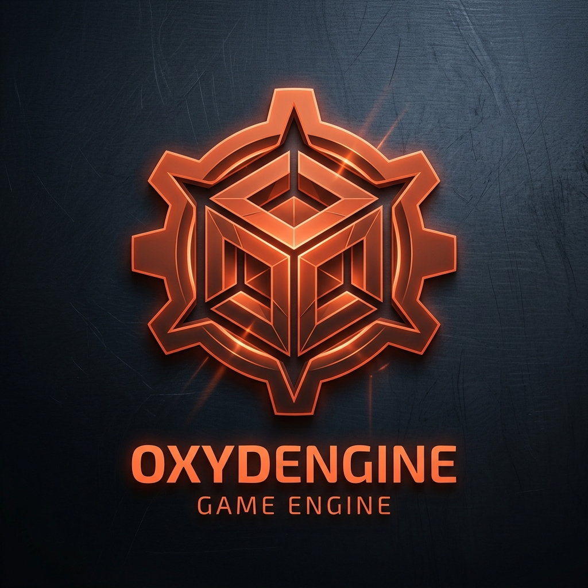

<div align="center">
  
  <h1>Oxyd Engine v0.0.1</h1>
  <p><strong>A Next-Generation High-Performance 3D Game Engine built in pure Rust & WGPU.</strong></p>

  [](https://www.rust-lang.org/)
  [](https://wgpu.rs/)
  [](#)
  [](LICENSE)
</div>

---

## ⚙ Overview

**Oxyd Engine** is an open-source, ultra-fast, cross-platform 3D game engine engineered from the ground up in **Rust**. Oxyd Engine provides developers, artists, and AI agents with modern tools to build, simulate, and render rich 3D worlds.

Designed for AI compatibility, high frame rates, and zero black-box friction, Oxyd Engine runs natively on **Windows**, **Linux**, and **Android**.

---

## ✨ Key Features

- ✈️ **Flight Navigation System**: Real-time 3D viewport navigation using `Right Click + WASD / QE`, orbit look around, middle-click pan, smooth scroll zoom, and instant `Key F` focus.
- 🌅 **Physical Atmosphere & Lighting System**: Native support for `DirectionalLight`, `SkyLight`, `ExponentialHeightFog`, `SkyAtmosphere`, and `VolumetricCloud`.
- 🎥 **Camera Actors (`CameraActor`)**: Full support for spawning and editing 3D camera actors with configurable FOV (Field of View), clip planes, and active viewport assignment.
- 📁 **Real-Time Content Drawer File Browser**: Dynamic filesystem browser matching Oxyd Engine styling (`Actors`, `Maps`, `Materials`, `Meshes`, `Textures`, `Decals`, `VFX`) with instant level loading.
- ⚡ **3D Physics & AABB Collision Engine**: Physics simulation with `-9.8 m/s²` gravity, ground detection, and Play/Stop simulation controls.
- ↩️ **Full Undo & Redo History System**: Scene state snapshots with `Ctrl+Z` (Undo) and `Ctrl+Shift+Z` / `Ctrl+Y` (Redo).
- 📑 **Map Assets & Details Panels**: Double-click item to focus camera, right-click context menu (Duplicate, Toggle Visibility, Delete), and alternating row highlight.
- 🌐 **30+ Languages i18n System**: Full internationalization system with a dedicated `LANGUAGE` picker.

---

## 🎮 Example Projects

Oxyd Engine includes the following pre-configured example project:
- 🏰 **`TopDownExample`**: 3D starter example project featuring pre-configured levels (`Map_MainMenu`, `Map_Lobby`, `Map_CityZombieSurvival`, `Map_Transition`).

---

## 🛠️ Quick Start & Building

### Requirements
- **Rust toolchain** (1.75+ recommended): [Install Rust](https://www.rust-lang.org/tools/install)
- **C++ Build Tools** (for WGPU bindings on Windows/Linux)

### Build & Run Locally
```bash
# Clone the repository
git clone https://github.com/lucasclivati/oxydengine.git
cd oxydengine

# Run in development mode
cargo run

# Build release executable
cargo build --release
```

After building, run `OxydEngine.exe` directly on Windows!

---

## ⌨ Short-keys & Controls

| Action | Shortcut |
|---|---|
| **Fly / Walk in 3D Viewport** | `Right Click + W / A / S / D` |
| **Elevate / Lower Viewport** | `Right Click + E / Q` |
| **Look Around Viewport** | `Right Click + Mouse Drag` |
| **Pan Viewport** | `Middle Click + Mouse Drag` |
| **Zoom Viewport** | `Mouse Scroll Wheel` |
| **Focus Camera on Selected** | `F` |
| **Toggle Content Drawer** | `Ctrl + Space` |
| **Undo Action** | `Ctrl + Z` |
| **Redo Action** | `Ctrl + Shift + Z` / `Ctrl + Y` |
| **Duplicate Actor** | `Ctrl + D` |

---

## 🤝 Contributing

Oxyd Engine is **100% Open Source**! Contributions, bug reports, and pull requests are warmly welcomed.

1. Fork the Project (`https://github.com/lucasclivati/oxydengine`)
2. Create your Feature Branch (`git checkout -b feature/AmazingFeature`)
3. Commit your Changes (`git commit -m 'Add some AmazingFeature'`)
4. Push to the Branch (`git push origin feature/AmazingFeature`)
5. Open a Pull Request

---

<div align="center">
  <p>Built with ❤️ and Rust by Lucas Clivati & the Oxyd Engine Community.</p>
</div>
